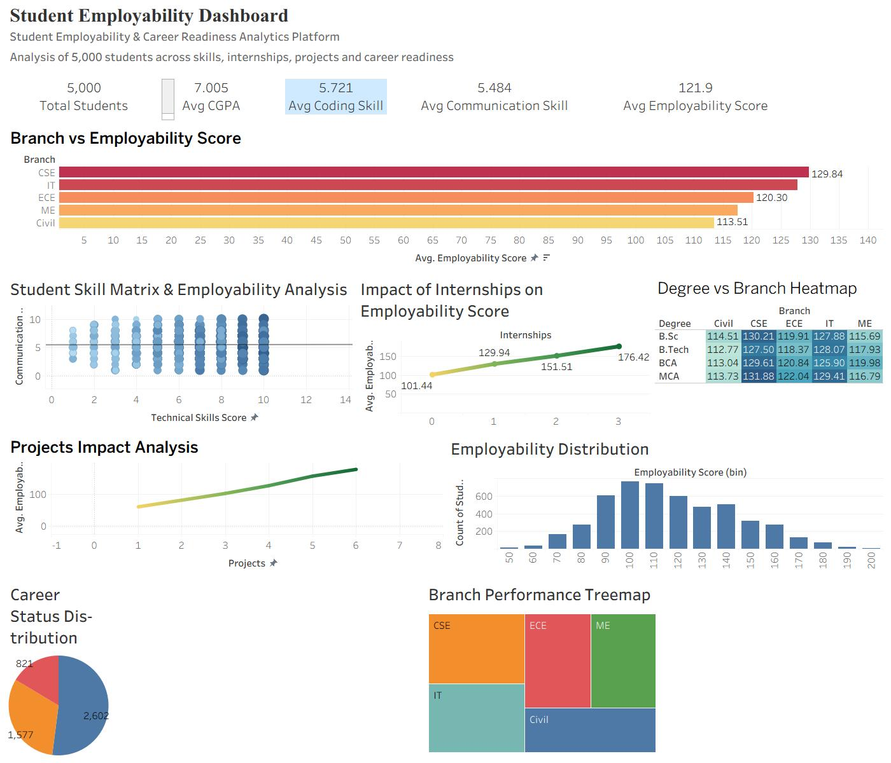

<div align="center">

# 📊 Student Employability Analytics Dashboard

### Transforming Student Data into Career Readiness Insights


</div>

---

# 🚀 Project Overview

This project analyzes the employability and career readiness of **5,000 students** using advanced Tableau visualizations.

The dashboard helps identify how factors such as:

- Technical Skills
- Communication Skills
- Internships
- Academic Performance (CGPA)
- Projects
- Degree Programs
- Branches

influence student employability outcomes.

The goal is to transform raw educational data into meaningful insights for academic institutions, placement departments, recruiters, and students.

---

# 🎯 Business Problem

Educational institutions often struggle to identify:

- Which students are placement-ready
- Which skills impact employability the most
- Whether internships improve career outcomes
- Which academic branches perform best
- How employability scores are distributed

This dashboard provides a centralized analytical view for decision-making.

---

# 📈 Key Performance Indicators (KPIs)

| KPI | Value |
|------|--------|
| Total Students | 5,000 |
| Average CGPA | 7.005 |
| Average Coding Skills | 5.721 |
| Average Communication Skills | 5.484 |
| Average Employability Score | 121.9 |

---

# 📊 Dashboard Components

## 1️⃣ Branch vs Employability Score

Analyzes average employability score across academic branches.

### Key Finding

- CSE students show the highest employability score.
- Civil students show comparatively lower employability.

---

## 2️⃣ Student Skill Matrix

Visual relationship between:

- Coding Skills
- Communication Skills
- Employability Score

### Key Finding

Students with stronger technical and communication skills generally achieve higher employability scores.

---

## 3️⃣ Internship Impact Analysis

Measures how internships affect employability.

### Key Finding

Students completing more internships tend to have significantly higher employability scores.

---

## 4️⃣ Projects Impact Analysis

Measures project experience against employability.

### Key Finding

Practical project work positively influences employability outcomes.

---

## 5️⃣ Degree vs Branch Heatmap

Compares performance across:

- B.Tech
- BCA
- MCA
- B.Sc

and multiple branches.

### Key Finding

Certain degree-branch combinations consistently outperform others.

---

## 6️⃣ Employability Distribution

Histogram showing overall score distribution.

### Key Finding

Most students fall within the medium-to-high employability range.

---

## 7️⃣ Career Status Distribution

Visual breakdown of:

- Placement Ready
- Needs Improvement
- High Risk

student categories.

---

## 8️⃣ Branch Performance Treemap

Quick visual comparison of branch-level performance.

---

# 🛠 Tech Stack

| Tool | Purpose |
|--------|----------|
| Tableau | Dashboard Development |
| Excel / CSV | Data Source |
| Data Analytics | Insights Generation |
| Data Visualization | Storytelling |

---

# 📂 Dataset Information

Dataset Size:

```text
5,000 Student Records
13 Attributes
```

Main Features:

- Student ID
- Age
- Gender
- Degree
- Branch
- CGPA
- Coding Skills
- Communication Skills
- Internships
- Projects
- Employability Score
- Career Status

---

# 💡 Insights Generated

✔ Internship experience strongly impacts employability.

✔ Technical and communication skills together create better career outcomes.

✔ Branch-wise employability differences are clearly visible.

✔ Higher project involvement correlates with stronger employability.

✔ Skill gaps can be identified quickly for intervention programs.

---

# 📷 Dashboard Preview

## Full Dashboard



---

# 👨‍💻 About Me

**Dev Darji**

B.Tech Information Technology Student

Passionate about:

- Data Analytics
- Data Science
- Business Intelligence
- Tableau
- Python
- Machine Learning

### Connect With Me

- LinkedIn: YOUR_LINKEDIN_URL
- GitHub: YOUR_GITHUB_URL

---

# ⭐ If you found this project useful

Please consider giving this repository a star.
